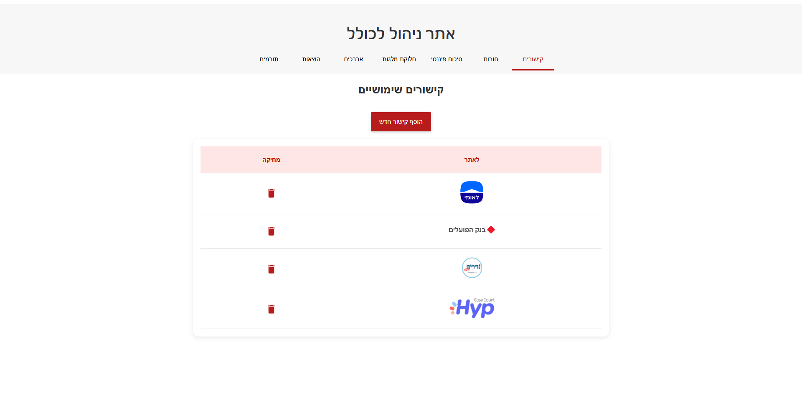
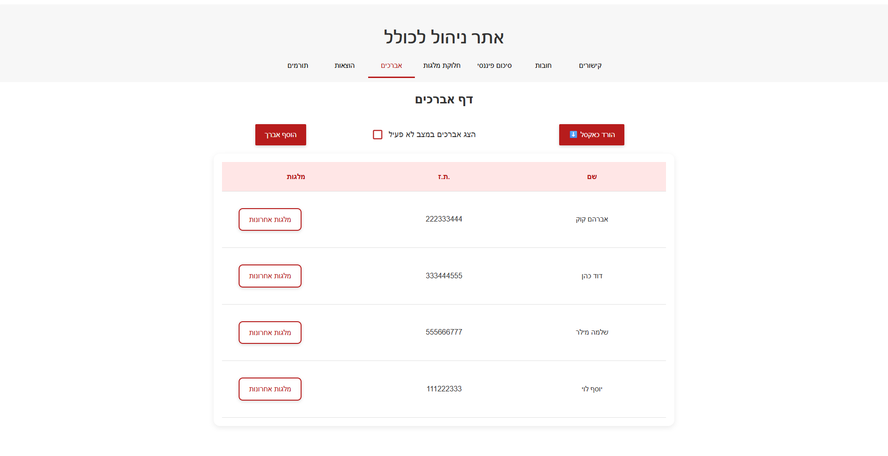
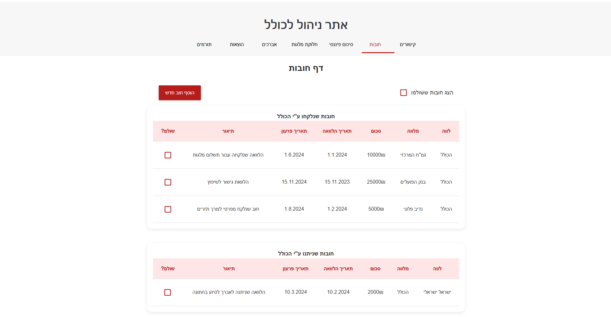
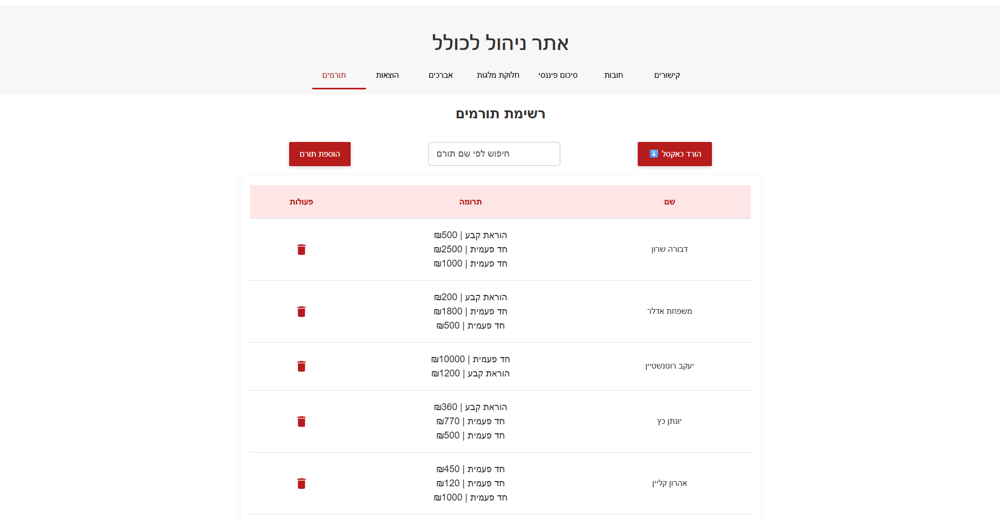
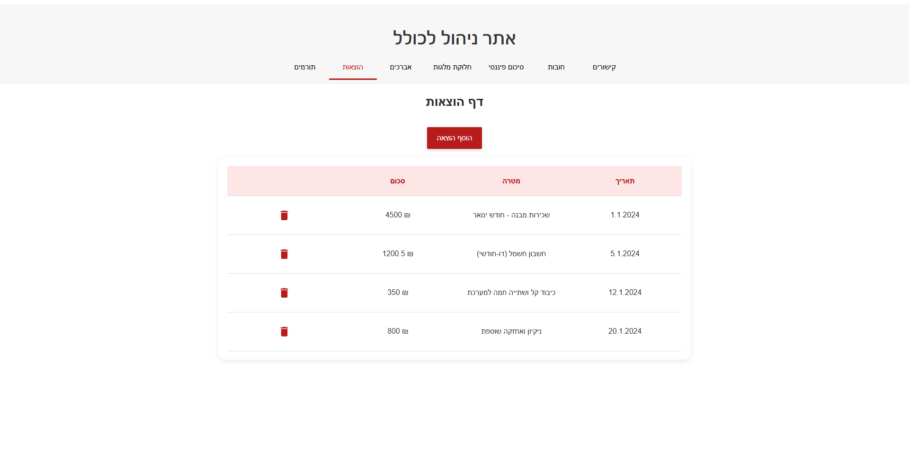

# Daat Yehudit Management System


A comprehensive full-stack web application for managing the financial and administrative operations of a nonprofit [Kollel](https://en.wikipedia.org/wiki/Kollel)  organization — covering donor tracking, avrechim (scholars) management, scholarships, debts, expenses, and automated email reminders. The application is fully in Hebrew with RTL support.


## Table of Contents

- [Overview](#overview)
- [Features](#features)
- [Architecture](#architecture)
- [Tech Stack](#tech-stack)
- [API Overview](#api-overview)
- [Database](#database)
- [Prerequisites](#prerequisites)
- [Getting Started](#getting-started)
- [Project Structure](#project-structure)
- [UI Design](#ui-design)
- [UI Screenshots](#ui-screenshots)

---

## Overview

Daat Yehudit is a full-stack management system built for the internal operations of a religious organization. The system centralizes the management of donors and their donation history, avrechim (Torah scholars) and their assigned scholarships, debts, general expenses, and financial summaries — all in one place. It also includes automated email reminders for upcoming memorials and birthdays, and supports data export to Excel. The application is fully in Hebrew with RTL support..

---

## Features
  **Donor Management**:
  - Comprehensive donor profiles with personal information, contact details, and donation history
  - memorial tracking with automated reminders for memorial dates
  - Donation recording with date, amount, and purpose tracking
  - Donor categorization and search functionality

  **Avrechim Tracking**:
  - Detailed scholar profiles including personal information and family details
  - Activity status management (active/inactive scholars)
  - Scholarship (milga) assignment and tracking
  - Excel export for detailed avrechim reports

  **Debt Management**:
  - Track both given (loans to others) and taken (loans from others) debts
  - Historical debt records with payment schedules


  **Expense Tracking**:
  - Date and amount tracking with detailed descriptions

  **Financial Summaries**:
  - Comprehensive expense and income table including various expenses, scholarships and income - donations,
  - Filtering by donation type and payment method.


  **Milgot Management**:
  - Distribution of scholarships in several ways:
  - One scholarship for a specific scholar
  - Update a uniform scholarship for all scholars
  - Update scholarships for all scholars with details and a different amount for each

  **Link Management**:
  - Centralized storage of important organizational links

  **Email Notifications**:
  - Automated memorial reminders to donors
  - Birthday notifications for donors
  - Scheduled email delivery system

  **Data Export**:
  - Excel export for donor lists with complete contact information
  - scholars data export with scholarship details

  **Responsive UI**:
  - Modern Material-UI design with Hebrew RTL support
  - Intuitive navigation with organized component structure
  - Form validation and user-friendly error handling
  - Consistent design language throughout the application

---

## Architecture
The application follows a modular full-stack architecture:

- **Frontend**: React single-page application with component-based structure
- **Backend**: Express.js REST API server with MVC pattern
- **Database**: MongoDB with Mongoose ODM
- **Authentication**: JWT-based authentication system
- **Background Jobs**: Cron jobs for automated tasks (donations, emails)
- **Email Service**: Nodemailer integration for notifications

---


## Tech Stack

### Frontend
- React 19.2.0
- Material-UI (MUI) 7.3.4
- React Router DOM 7.9.4
- Axios 1.12.2
- React Hook Form 7.69.0
- Yup validation
- XLSX for Excel export

### Backend
- Node.js
- Express 5.1.0
- MongoDB with Mongoose 8.15.1
- JWT for authentication
- bcrypt for password hashing
- Nodemailer 7.0.10
- CORS support

### Development Tools
- Nodemon for development
- Create React App
- ESLint

---


## API Overview

The REST API provides endpoints for all major entities:

- `/api/donors` - Donor management (CRUD operations, donations, memorial)
- `/api/avrechim` - Avrechim management (CRUD, milgot assignment)
- `/api/expenses` - Expense tracking
- `/api/debts` - Debt management (given/taken debts)
- `/api/links` - Link management
- `/api/integration` - Integration endpoints
- `/api/user/login` - User authentication
- `/api/user/register` - User registration

All endpoints return JSON responses with appropriate HTTP status codes.

---

## Database

The application uses MongoDB as the primary database with the following main collections:

- **Donors**: Donor information, contact details, donation history
- **Avrechim**: Scholar details, activity status, milgot assignments
- **Debts**: Debt records with payment tracking
- **Expenses**: Expense entries with categorization
- **Milgot**: Scholarship information and assignments
- **Links**: Organizational links and resources
- **Users**: User accounts for authentication

---

## Prerequisites

Before running this application, ensure you have the following installed:

- Node.js (version 14 or higher)
- npm or yarn package manager
- MongoDB database (local or cloud instance)
- Git for version control

---

## Getting Started

1. **Clone the repository**
   ```bash
   git clone https://github.com/yaeli6858/Daat-Yehudit-Management
   cd Daat-Yehudit-Management
   ```

2. **Install server dependencies**
   ```bash
   cd server
   npm install
   ```

3. **Install client dependencies**
   ```bash
   cd ../client
   npm install
   ```

4. **Set up environment variables**
   Create a `.env` file in the server directory with:
   ```
   PORT=1111
   DATABASE=mongodb://localhost:27017/daatyehudit

   MAIL_HOST=smtp.example.com
   MAIL_PORT=587
   MAIL_USER=your-email@gmail.com
   MAIL_PASS=your-email-password
   EMAIL_RECIPIENT=recipient@example.com
   ```

5. **Start MongoDB**
   Ensure MongoDB is running on your system.

6. **Start the backend server**
   ```bash
   cd server
   npm run dev
   ```

7. **Start the frontend client**
   ```bash
   cd ../client
   npm start
   ```

8. **Access the application**
   Open your browser and navigate to `http://localhost:3000`
   > The backend server runs on `http://localhost:1111`

---

## Project Structure

```
DaatYehudit/
├── client/                          # React frontend
│   ├── public/                      # Static assets
│   ├── src/
│   │   ├── Components/              # React components
│   │   │   ├── Alerts/              # Notification components
│   │   │   ├── Avrechim/            # Avrechim management
│   │   │   ├── Debts/               # Debt management
│   │   │   ├── Donors/              # Donor management
│   │   │   ├── Expenses/            # Expense tracking
│   │   │   ├── FinanceSummary/      # Financial reports
│   │   │   ├── GeneralComponents/   # Shared components
│   │   │   ├── Links/               # Link management
│   │   │   └── Milgot/              # Scholarship management
│   │   ├── MainDesign/              # Theme and styling
│   │   ├── Validation/              # Form validation
│   │   ├── App.js                   # Main app component
│   │   └── index.js                 # App entry point
│   └── package.json
├── server/                          # Express backend
│   ├── config/                      # Configuration files
│   ├── controllers/                 # Route handlers
│   ├── cron/                        # Scheduled tasks
│   ├── MailService/                 # Email utilities
│   ├── models/                      # MongoDB models
│   ├── routes/                      # API routes
│   ├── server.js                    # Server entry point
│   └── package.json
├── package.json                     # Root package file
└── README.md                        # This file
```

---

## UI Design

The entire application theme is defined in a single file: client/src/MainDesign/theme.js, using Material-UI's createTheme. This centralized approach makes it easy to update the look and feel of the whole app from one place.

## UI Screenshots

### finacial report


### links page



### milgot page


### avrechim page


### debts page


### donors page


### add donor


### donor details card


### expenses page



